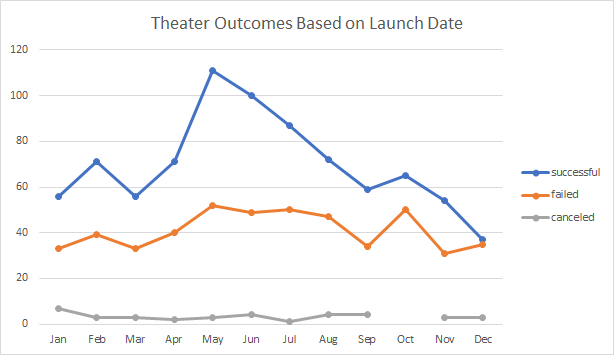
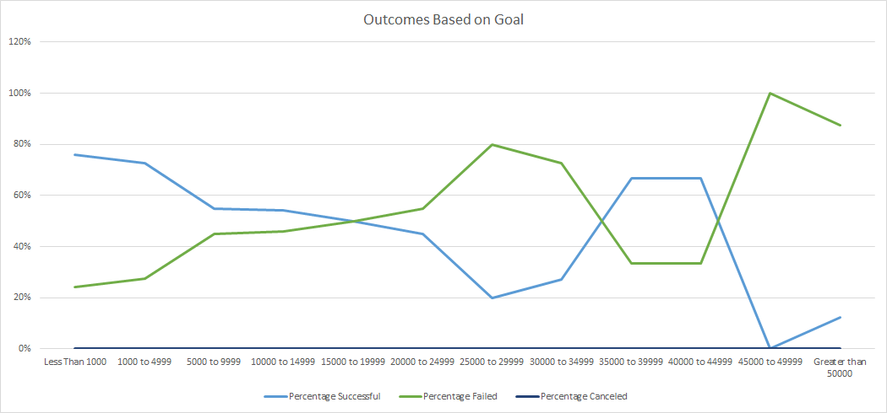

# kickstarter-analysis
Performing analysis on kickstarter data to uncover trends

## Overview of Project: 
THis analysis is focused around the challenge presented by Louise where she is looking for fundraising for her play Fever. She would like to know how different campaigns fared in relation to their launch dates and their funding goals. To present her with the trends of each campaign I have visualized campaign outcomes based on their launch dates and their funding goals and then submit a written report based on my analysis and the visualizations I created.

### Purpose : 
To Compare the Outcomes of campaigns in Theatre Category based on launch dates and in Plays Subcategory based on goals set for funding

## Analysis and Challenges
### Analysis of Outcomes Based on Launch Date: 
To find out outcomes of the theater campaigns based on launch dates I first created a column to display the year of each campaign. Then by using pivot feature in excel, on the Kickstarter sheet, I listed down the sum of each outcome for all the theater campaigns for each month from year 2009 to 2017. For this I used Parent category and years as filters. I placed the Dates created in rows and sum of outcomes in the Values. After getting the sum of each outcome month wise, I then created a graph displaying the outcomes, visually month over month for all the years.
### Analysis of Outcomes Based on Goals : 
To find the percentage of successful, failed, and canceled plays based on the range of goals of funding set by campaigns I first created sheet with rows for range of funding and columns for sum of each outcome in each range. Using Countifs function I was able to get sum of each outcome against the defined range. Then by adding the outcomes for each range I calculated the percent of each outcome for the said range. Then I plotted these percentages on a graph against the range to get a trend of the outcomes for each range.
### Challenges and Difficulties Encountered: 
While working on outcomes based on goals at the Countifs function faced some challenges in capturing the ranges as well as the other criteria for each cell as the reference ranges kept on changing. Then used the F4 key to add $ symbols on both sides of the reference ranges to keep it constant while copying it in different cells.

## Results
- What are two conclusions you can draw about the Outcomes based on Launch Date?
1. Theater campaigns launched between April and Sep were more successful rather than in other months of the year.
2. Failed campaigns were didn’t vary much throughout the year.

- What can you conclude about the Outcomes based on Goals?
1. Campaigns with a aggressive goal of fundraising suffered either by lower success rate or failure to raise funds set in their goals.

- What are some limitations of this dataset?
1. Deadline and launch dates are not in the DDMMYY format. They are in the Unix date format. 

- What are some other possible tables and/or graphs that we could create?
1. Parent Category Outcomes
2. Subcategories Outcomes
3. Using VLOOKUP get Blurbs for certain plays.
